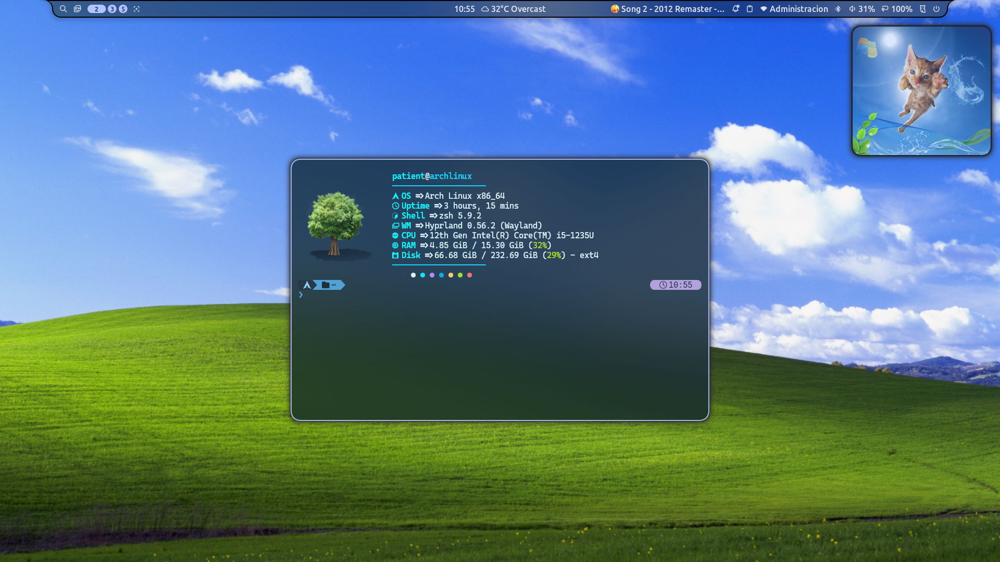
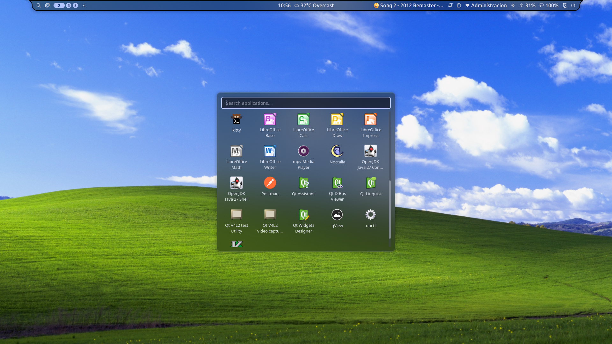
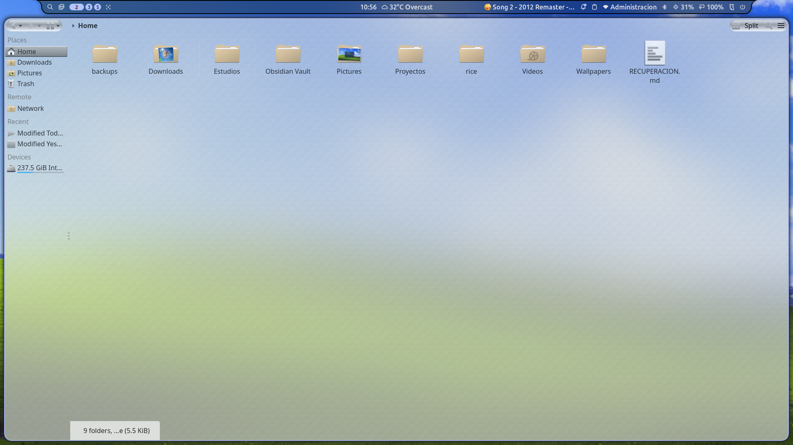
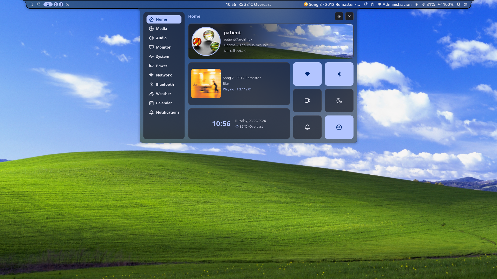
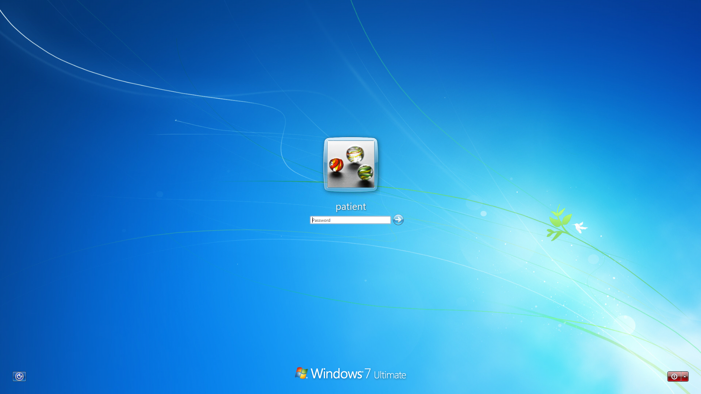

# &nbsp;Aeroctalia

<br clear="all" />

Hyprland desktop setup for Arch Linux: Hyprland, Noctalia, Kvantum and AwOken.

## Capturas / Screenshots

| Escritorio | Noctalia | Dolphin |
| --- | --- | --- |
|  |  | 
| Opciones | Login |
|  |  |

## Español

Instalador y configuración de escritorio para Arch Linux. Configura Hyprland, Noctalia, temas y servicios del escritorio.

> El instalador modifica `$HOME` y `/etc`, e instala paquetes. Revisa el plan antes de confirmar. Chaotic-AUR solo se agrega con tu aprobación.

### Instalar

```
git clone https://github.com/patient-c/Aeroctalia
cd Aeroctalia
./install.sh --dry-run
./install.sh
```

Al iniciar, elige español o inglés. Requiere Arch Linux, conexión a internet y `sudo` para los cambios del sistema.

### Opciones

| Comando            | Función                                                                    |
| ------------------ | -------------------------------------------------------------------------- |
| `--verify`         | Comprueba la configuración sin instalar.                                   |
| `--dry-run`        | Muestra el plan sin aplicar cambios.                                       |
| `--restore`        | Restaura el último respaldo.                                               |
| `--no-chaotic`     | No agrega Chaotic-AUR; intenta usar AUR.                                   |
| `--profile=author` | Aplica el perfil visual opcional del autor.                                |
| `--profile=none`   | Instala sin perfil adicional.                                              |
| `--uninstall`      | Quita solo algunos archivos de Aeroctalia en `$HOME`; no elimina paquetes. |

El perfil `author` incluye wallpapers, pero no fija una ubicación para el clima. Para ver todas las opciones: `./install.sh --help`.

## English

Installer and desktop configuration for Arch Linux. Sets up Hyprland, Noctalia, themes and desktop services.

> The installer changes files in `$HOME` and `/etc`, and installs packages. Review the plan before confirming. Chaotic-AUR is added only with your approval.

### Install

```
git clone https://github.com/patient-c/Aeroctalia
cd Aeroctalia
./install.sh --dry-run
./install.sh
```

Choose Spanish or English when prompted. Requires Arch Linux, an internet connection, and `sudo` for system changes.

### Options

| Command            | Purpose                                                                 |
| ------------------ | ----------------------------------------------------------------------- |
| `--verify`         | Check configuration without installing.                                 |
| `--dry-run`        | Show the plan without applying changes.                                 |
| `--restore`        | Restore the latest backup.                                              |
| `--no-chaotic`     | Skip Chaotic-AUR; try to use the AUR.                                   |
| `--profile=author` | Apply the optional author visual profile.                               |
| `--profile=none`   | Install without an extra profile.                                       |
| `--uninstall`      | Remove only some Aeroctalia files in `$HOME`; does not remove packages. |

The `author` profile includes wallpapers but does not set a weather location. See `./install.sh --help` for all options.

## Documentación / Documentation

- [Solución de problemas / Troubleshooting](docs/MANUAL.md)
- [Dolphin e iconos / Dolphin and icons](docs/DOLPHIN.md)
- [Historial de cambios / Changelog](docs/CHANGELOG.md)
- [Licencias de terceros / Third-party licenses](LICENSES.md)

## Recursos geniales / Cool resources

[Frutiger Aero Archive](https://frutigeraeroarchive.org/)  

<a href="https://frutigeraeroarchive.org/"></a>