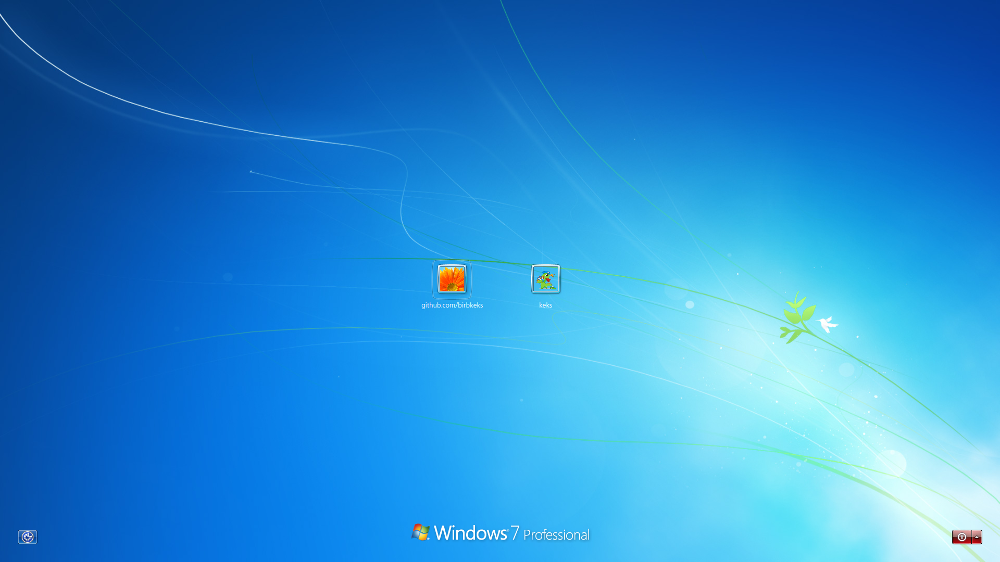

# Windows 7 Login Screen SDDM Theme
Microsoft® Windows™ is a registered trademark of Microsoft® Corporation. This name is used for referential use only, and does not aim to usurp copyrights from Microsoft. Microsoft Ⓒ 2026 All rights reserved. All resources belong to Microsoft Corporation.

Segoe™ is a registered trademark of the Microsoft® group of companies. This font family is used for referential use only, and does not aim to usurp copyrights from Microsoft.

Huge thanks to wackyideas for creating [Aero theme for Plasma](https://gitgud.io/wackyideas/aerothemeplasma), this SDDM theme uses some assets and codes from that theme.

## Table of contents

1. [Gallery](#gallery)
2. [Missing Features](#missing-features)
3. [Requirement](#requirements)
4. [Installation](#installation)
   - [With installation script](#with-installation-script)
   - [Manual installation](#manual-installation)

5. [Testing](#testing)

## Gallery

<details>
  <summary>Click to view screenshots</summary>
   


</details>

## Missing Features
Missing features from Windows 7 login screen that's planned to be added in the future:

- Successful login message [(this is a SDDM bug, waiting it to be fixed)](https://github.com/sddm/sddm/issues/1960)

## Requirements
> [!NOTE]
>It is no longer required to install Segoe UI font family and Segoe MDL2 Assets font family since they are now included in the theme directory under "fonts" folder. 

No extra Qt packages are required for KDE Plasma/Qt 6 or higher versions.

Other desktop environments might require; 
```
  qt5-declarative
  qt6-5compat
  qt6-base
  qt6-declarative
  qt6-multimedia
  qt6-multimedia-ffmpeg
  qt6-shadertools
  qt6-svg
  qt6-translations
  qt6-virtualkeyboard
```
package(s) to be installed in order for this theme to work properly.

## Installation
> [!CAUTION]
>If you are not using KDE Plasma make sure to install the [required packages](#requirements)!

> [!IMPORTANT]
>KDE Plasma/Qt 5 or lower versions might require additional Qt packages but there are no quarantee of the theme working properly. <br>
Please do NOT open an issue if you are using older versions of KDE Plasma/Qt, you're on your own.

### With installation script 
The installation script can be used to install the theme and apply it, install [Windows Cursors](https://github.com/syrupderg/windows-cursors) and [fix SDDM for Wayland and add On Screen Keyboard support](https://wiki.archlinux.org/title/SDDM#Wayland).

```
curl -O https://raw.githubusercontent.com/syrupderg/win7-sddm-theme/main/install.sh
chmod +x install.sh
./install.sh
```

### Manual installation:
1. Get the theme from [github releases](https://github.com/syrupderg/win7-sddm-theme/releases) or from [store.kde.org](https://store.kde.org/p/2192528/). 
2. Extract "win7-sddm-theme.tar.gz" to `/usr/share/sddm/themes/`.
3. If you are using KDE Plasma you can either,
   - Edit `/etc/sddm.conf.d/kde_settings.conf`  and under `[Theme]`, change `Current=` to `Current=win7-sddm-theme` <br>
or
   - Open System Settings -> Color & Themes -> Login Screen (SDDM) and pick win7-sddm-theme from there.

4. If you are using other desktop environments,
   - Edit `/etc/sddm.conf`  and under `[Theme]`, change `Current=` to `Current=win7-sddm-theme`.
5. Create a file named `10-wayland.conf` in the `/etc/sddm.conf.d/` directory.
6. To fix SDDM for Wayland and to add On Screen Keyboard support, copy and paste:
   ```
   [General]
   DisplayServer=wayland
   GreeterEnvironment=QT_WAYLAND_SHELL_INTEGRATION=layer-shell
   
   [Wayland]
   CompositorCommand=kwin_wayland --drm --no-lockscreen --no-global-shortcuts --locale1 --inputmethod plasma-keyboard
   ```
   into `10-wayland.conf` and save the file.


## Testing

If you want to test this theme before using it, you can use this command on your terminal to test this or other SDDM themes. Make sure to replace "/path/to/directory" with the directory of SDDM theme you installed.

```
env -i HOME=$HOME DISPLAY=$DISPLAY XAUTHORITY=$XAUTHORITY sddm-greeter-qt6 --test-mode --theme /path/to/directory
```



## Español

# Tema de inicio de sesión de Windows 7 para SDDM

Microsoft® Windows™ es una marca registrada de Microsoft® Corporation. Este
nombre se usa solo como referencia y no pretende apropiarse de los derechos de
autor de Microsoft. Microsoft © 2026. Todos los recursos pertenecen a
Microsoft Corporation.

Segoe™ es una marca registrada del grupo de empresas Microsoft®. Esta familia
tipográfica se usa solo como referencia y no pretende apropiarse de los
derechos de autor de Microsoft.

Muchas gracias a wackyideas por crear [Aero theme for Plasma](https://gitgud.io/wackyideas/aerothemeplasma),
del que este tema de SDDM usa algunos recursos y fragmentos de código.

## Contenido

1. [Galería](#galeria)
2. [Funciones pendientes](#funciones-pendientes)
3. [Requisitos](#requisitos)
4. [Instalación](#instalacion)
   - [Con el instalador](#con-el-instalador)
   - [Instalación manual](#instalacion-manual)
5. [Prueba](#prueba)

## Galería

<details>
  <summary>Haz clic para ver capturas</summary>


</details>

## Funciones pendientes

Función de la pantalla de inicio de Windows 7 prevista para una versión futura:

- Mensaje de inicio de sesión correcto ([es un error de SDDM que está pendiente de corregirse](https://github.com/sddm/sddm/issues/1960)).

## Requisitos

> [!NOTE]
> Ya no es necesario instalar las fuentes Segoe UI ni Segoe MDL2 Assets: se incluyen en la carpeta `fonts` del tema.

En KDE Plasma/Qt 6 o versiones posteriores no se necesitan paquetes Qt
adicionales.

En otros entornos de escritorio puede que debas instalar estos paquetes para
que el tema funcione correctamente:

```text
qt5-declarative
qt6-5compat
qt6-base
qt6-declarative
qt6-multimedia
qt6-multimedia-ffmpeg
qt6-shadertools
qt6-svg
qt6-translations
qt6-virtualkeyboard
```

## Instalación

> [!CAUTION]
> Si no usas KDE Plasma, instala los [paquetes necesarios](#requisitos).

> [!IMPORTANT]
> KDE Plasma/Qt 5 o versiones anteriores pueden requerir paquetes Qt adicionales, pero no se garantiza que el tema funcione. No abras incidencias por usar versiones antiguas de KDE Plasma/Qt; su uso queda bajo tu responsabilidad.

### Con el instalador

El instalador puede instalar y aplicar el tema, instalar [Windows Cursors](https://github.com/syrupderg/windows-cursors)
y [configurar SDDM para Wayland y añadir compatibilidad con el teclado en pantalla](https://wiki.archlinux.org/title/SDDM#Wayland).

```bash
curl -O https://raw.githubusercontent.com/syrupderg/win7-sddm-theme/main/install.sh
chmod +x install.sh
./install.sh
```

### Instalación manual

1. Descarga el tema desde [GitHub Releases](https://github.com/syrupderg/win7-sddm-theme/releases)
   o [store.kde.org](https://store.kde.org/p/2192528/).
2. Extrae `win7-sddm-theme.tar.gz` en `/usr/share/sddm/themes/`.
3. En KDE Plasma, elige una de estas opciones:
   - Edita `/etc/sddm.conf.d/kde_settings.conf` y cambia `Current=` bajo `[Theme]` a `Current=win7-sddm-theme`.
   - Abre Configuración del sistema → Colores y temas → Pantalla de inicio de sesión (SDDM) y selecciona `win7-sddm-theme`.
4. En otros entornos de escritorio, edita `/etc/sddm.conf` y establece `Current=win7-sddm-theme` bajo `[Theme]`.
5. Crea `10-wayland.conf` en `/etc/sddm.conf.d/`.
6. Para configurar SDDM con Wayland y habilitar el teclado en pantalla, pega lo siguiente en `10-wayland.conf` y guarda el archivo:

   ```ini
   [General]
   DisplayServer=wayland
   GreeterEnvironment=QT_WAYLAND_SHELL_INTEGRATION=layer-shell

   [Wayland]
   CompositorCommand=kwin_wayland --drm --no-lockscreen --no-global-shortcuts --locale1 --inputmethod plasma-keyboard
   ```

## Prueba

Para probar este u otro tema de SDDM antes de usarlo, ejecuta este comando en
una terminal. Sustituye `/path/to/directory` por la ruta al tema instalado:

```bash
env -i HOME=$HOME DISPLAY=$DISPLAY XAUTHORITY=$XAUTHORITY sddm-greeter-qt6 --test-mode --theme /path/to/directory
```


